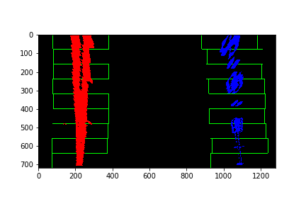

## Advanced Lane Finding Project

### The goals / steps of this project are the following:

* Compute the camera calibration matrix and distortion coefficients given a set of chessboard images.
* Apply a distortion correction to raw images.
* Use color transforms, gradients, etc., to create a thresholded binary image.
* Apply a perspective transform to rectify binary image ("birds-eye view").
* Detect lane pixels and fit to find the lane boundary.
* Determine the curvature of the lane and vehicle position with respect to center.
* Warp the detected lane boundaries back onto the original image.
* Output visual display of the lane boundaries and numerical estimation of lane curvature and vehicle position.

### Camera Calibration

#### 1. Briefly state how you computed the camera matrix and distortion coefficients. Provide an example of a distortion corrected calibration image.

The code for this step is contained in the first code cell of the IPython notebook located in "./P2 - Advance Lane Lines.ipynb" I started by preparing "object points", which will be the (x, y, z) coordinates of the chessboard corners in the world. Here I am assuming the chessboard is fixed on the (x, y) plane at z=0, such that the object points are the same for each calibration image. Thus, objp is just a replicated array of coordinates, and objpoints will be appended with a copy of it every time I successfully detect all chessboard corners in a test image. imgpoints will be appended with the (x, y) pixel position of each of the corners in the image plane with each successful chessboard detection.

I then used the output objpoints and imgpoints to compute the camera calibration and distortion coefficients using the cv2.calibrateCamera() function.

As an example, I used the camera calibration and distortion coefficients to undistort the image: 

After undistortion, image looked like:

### Pipeline (single images)

#### 1. Distortion-corrected image.
The images for camera calibration are stored in the folder called camera_cal. I compute the camera matrix and distortion co-efficients to undistort the image. After applying the distortion correction, test images looked like this one:

#### 2. Describe how (and identify where in your code) you used color transforms, gradients or other methods to create a thresholded binary image.  Provide an example of a binary image result.
First I created binary image by applying gradient X thresholds and Then, I created binary image after applying HLS and HSV color thresholds to detect yellow and white lane colors as shown below.

Then OR'ed above binary images as shown below:

#### 3. Describe how (and identify where in your code) you performed a perspective transform and provide an example of a transformed image.

After applying perspective transform, here is how binary image and test image looked like:

#### 4. Describe how (and identify where in your code) you identified lane-line pixels and fit their positions with a polynomial?

I then performed a sliding window search on the bottom half (as lanes are in bottom half portion throughout) of the binary image obtained in above step, starting with the base likely positions of the 2 lanes, calculated from the histogram. I have used 9 windows of width 100 pixels. Here is the Histogram image as shown below.

The x & y coordinates of non zeros pixels are found, a polynomial is fit for these coordinates and the lane lines are drawn.

#### 5. Describe how (and identify where in your code) you calculated the radius of curvature of the lane and the position of the vehicle with respect to center.

I calculated radius of curvature inside function measure_curvature. Mathematical formula I used for calculation of radius of curvature is:
## f(y)=Ay^2+By+C
Also, I calculated centre offset inside function measure_centre_offset by calculating distance between centre of lane and centre of image.

Radius of Curvature and Centre Offset is shown in the output video as

#### 6. Provide an example image of your result plotted back down onto the road such that the lane area is identified clearly.

### Pipeline (video)

#### 1. Provide a link to my final video output.

Here's a [link to my video result](./output_videos/project_video_output.mp4)

---

### Discussion

#### 1. Briefly discuss any problems / issues you faced in your implementation of this project.  Where will your pipeline likely fail?  What could you do to make it more robust?

#### 1. Points of failure & Areas of Improvement
Improvements required:

If there are sharp turns, then perspective transform will keep some of the lane pixels out of the histogram image and thus lane lines cannot be drawn accurately. So improving the logic of getting histogram image with all the lane pixels after perspective transform may help.
Improvement in bit mask extraction for detection of lane pixels which are not bright (white).
Checking if radius of curvature of the two polynomials is almost same or not.
Failures:

The pipeline seems to fail for the harder challenge video. This video has sharper turns and at very short intervals. Maybe, polynomials of higher degree (maybe 3) can help in drawing lane lines. In this case, calculation of radius of curvature will be difficult due to complexity involved in calculating derivative of the polynomial.
